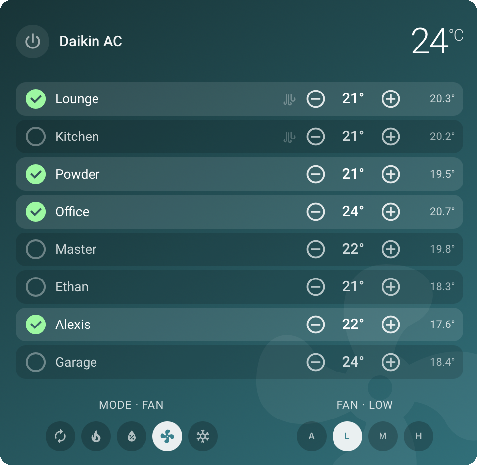
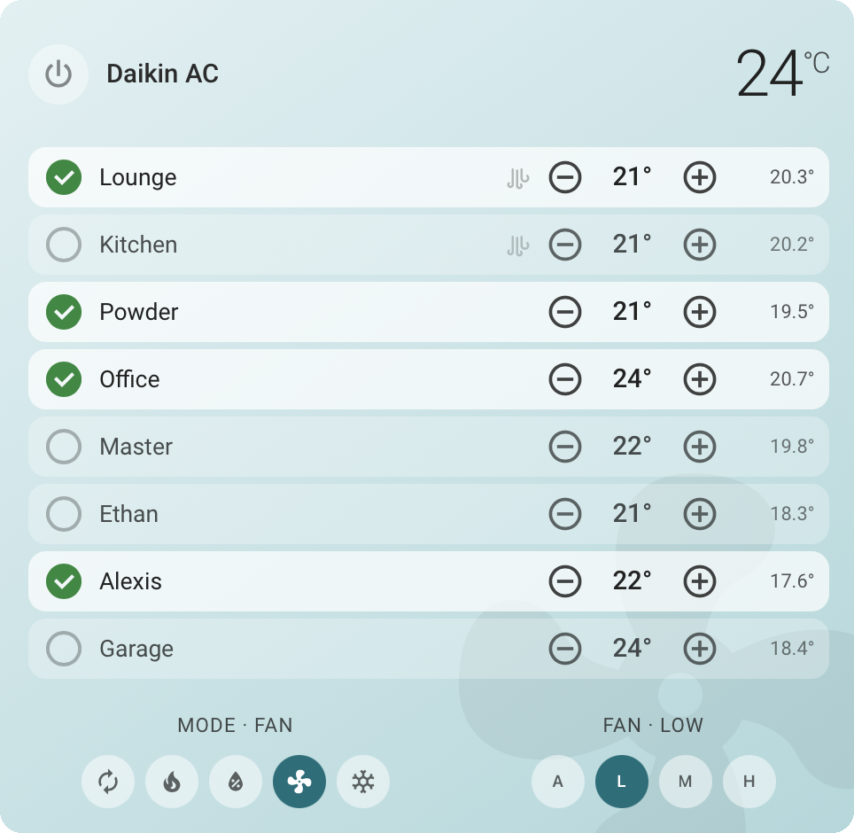
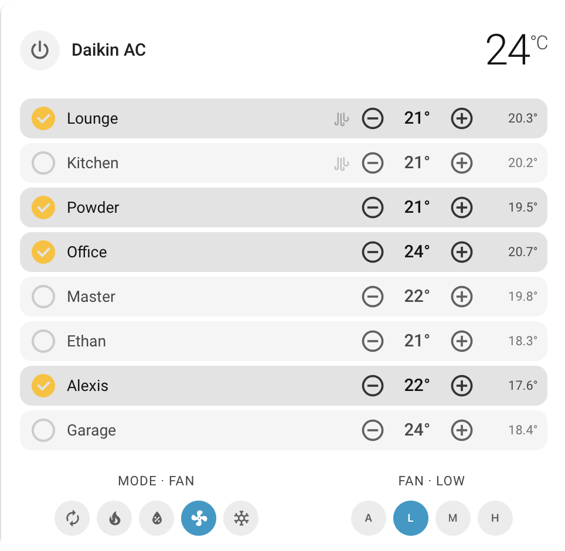

# AirTouch Card

A Lovelace card for **AirTouch 4 and AirTouch 5** systems in Home Assistant, recreating the Polyaire AirTouch console experience: main AC power, mode and fan control, plus per-zone selection and setpoints — all in one card with a GUI editor and zone auto-discovery.

### Three styles, selectable in the GUI editor

<p align="center">
  
  
  
</p>
<p align="center"><sub>Bold &middot; Light &middot; Default (follows your theme)</sub></p>

Designed as a **companion to the [mycrouch/hass-airtouch](https://github.com/mycrouch/hass-airtouch) integration** (a fork of [TheNoctambulist/hass-airtouch](https://github.com/TheNoctambulist/hass-airtouch) that adds a selectable AirTouch 4/5 direct-connection mode for consoles on a different subnet/VLAN to Home Assistant). The card also works with the upstream integration, and degrades gracefully on the built-in `airtouch4` core integration.

## Features

- **Native console look** — background gradient tinted by the active mode (cool blue, heat orange, dry amber, fan teal), with a subtle oversized mode-icon watermark, just like the AirTouch panel. When the AC is off, the last active mode's colour is kept and only the power button reflects the off state.
- **Header** — single power toggle, card title, and the effective AC setpoint computed the way the console shows it: the highest setpoint among open zones (falls back to the AC entity's target when no zones are open).
- **Zone rows** — tap the check-circle *or the zone name* to select/deselect a zone (dampers open/close even while the AC is off), −/+ setpoint controls, and the zone's current temperature. Zone open/closed state is read from the integration's damper cover entity, so it's accurate when the AC is off.
- **Spill zones** — zones designated as spill on the AirTouch system show a faint airflow marker that lights up green while the zone is actively spilling. Detected automatically; nothing to configure.
- **Low battery** — an amber battery icon appears on a zone when its temperature sensor battery is low.
- **Mode & fan chips** — one-row selectors. Changing mode uses the integration's `airtouch.set_hvac_mode_only` service where available, so selecting a mode does **not** power the AC on (falls back to `climate.set_hvac_mode` otherwise).
- **GUI editor with zone auto-discovery** — pick your AC entity and zones are discovered automatically (via the entity registry, `device_class: ac`/`zone`, with heuristic fallbacks). Rename zones in the card without touching the entity registry; add/remove/re-discover at any time.
- **Robust entity resolution** — damper, spill and battery entities are resolved through the entity registry (zone → device → sibling entities), so renamed entity IDs don't break anything. Per-zone manual overrides are available if you have an exotic setup.
- **Responsive layout** — the card auto-resizes to its Lovelace column: zone rows and the mode/fan controls reflow side by side in wide columns and stack in narrow ones (see the two screenshots above).
- **Single file, no assets** — all graphics are inline SVG. No images to install, no external resources.

## Installation

### HACS

1. HACS → menu (⋮) → **Custom repositories** → add `https://github.com/mycrouch/airtouch-card`, category **Dashboard**.
2. Download **AirTouch Card**. The Lovelace resource is registered automatically.

### Manual

Copy `airtouch-card.js` to `config/www/` and add a dashboard resource:

```yaml
url: /local/airtouch-card.js
type: module
```

## AirTouch 5

The card is integration-driven, so AirTouch 5 systems are supported through the same [hass-airtouch](https://github.com/mycrouch/hass-airtouch) integration — including the extra AT5 fan modes (Quiet, Powerful, Turbo, Intelligent Auto). Developed and tested on AirTouch 4 hardware; AT5 feedback welcome via issues.

The legacy `custom:airtouch4-card` type keeps working as an alias, so existing dashboards are unaffected by the rename.

## Recommended integration

For full functionality use [mycrouch/hass-airtouch](https://github.com/mycrouch/hass-airtouch) (or upstream [TheNoctambulist/hass-airtouch](https://github.com/TheNoctambulist/hass-airtouch)), which provides the damper covers, spill and battery sensors, `device_class` markers, and the `set_hvac_mode_only` service the card takes advantage of. The fork adds a **direct-connection option (AirTouch 4 or 5)** for networks where the console sits on a different subnet/VLAN and UDP discovery can't cross — if your setup fails with "Failed to connect to AirTouch console", that's the fix.

With the built-in `airtouch4` core integration the card still renders and controls setpoints, but zone state while the AC is off, spill/battery indicators, and mode-change-without-power-on are unavailable (and that integration's zone power control is broken upstream).

## Configuration

Everything is configurable in the GUI editor (Add card → **AirTouch Card**). YAML equivalent:

```yaml
type: custom:airtouch-card
entity: climate.daikin           # main AC (device_class: ac)
name: Daikin AC                  # optional card title
step: 1                          # optional, zone setpoint step in °C
show_zone_current: true          # optional, zone current temperature
show_watermark: true             # optional, background mode watermark
zones:                           # auto-discovered; override to reorder/rename
  - entity: climate.lounge_room_lounge
    name: Lounge                 # display-name override (card only)
  - entity: climate.kitchen_kitchen
    name: Kitchen
```

| Option | Default | Description |
|---|---|---|
| `entity` | required | Main AC climate entity |
| `name` | entity name | Card title |
| `style` | `bold` | `default` (no background, follows theme), `bold` (dark mode-tinted gradient), or `light` (pastel mode-tinted gradient) |
| `step` | `1` | Zone setpoint increment (°C) |
| `show_zone_current` | `true` | Show each zone's measured temperature |
| `show_watermark` | `true` | Faint mode-icon watermark behind the gradient |
| `zones[].entity` | required | Zone climate entity |
| `zones[].name` | entity name | Display name (card-only rename) |
| `zones[].damper_entity` | auto | Override the zone's damper cover entity |
| `zones[].spill_entity` | auto | Override the zone's spill binary sensor |
| `zones[].battery_entity` | auto | Override the zone's battery binary sensor |
| `zones[].temp_up_service` | — | Custom service for temp up (e.g. `script.x`) |
| `zones[].temp_down_service` | — | Custom service for temp down |

## Related projects

| Repo | What it is |
|---|---|
| [hass-airtouch](https://github.com/mycrouch/hass-airtouch) | Polyaire AirTouch 4/5 integration (fork) with a direct-connection mode for consoles on a different subnet/VLAN |
| [airtouch-card](https://github.com/mycrouch/airtouch-card) | Lovelace card for AirTouch 4/5 - console-style zone control with GUI editor and auto-discovery |
| [gradient-themes](https://github.com/mycrouch/gradient-themes) | 40 gradient dashboard themes (20 colours, dark + pastel variants) |
| [ecovacs-vacuum-card](https://github.com/mycrouch/ecovacs-vacuum-card) | Ecovacs/Deebot vacuum card with per-card theming (default / installed theme / manual gradient) |

## License

MIT. Icon paths from [Material Design Icons](https://pictogrammers.com/library/mdi/) (Apache 2.0).
